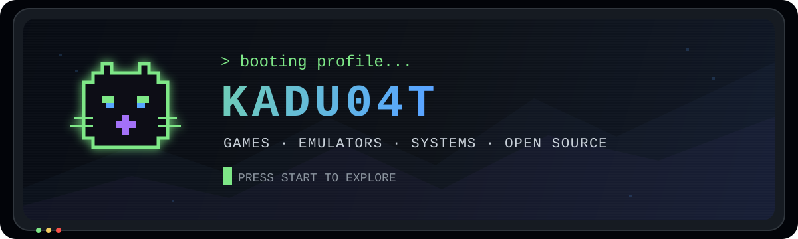
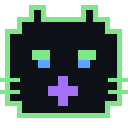

<div align="center">
  
</div>

<div align="center">
  <a href="#-featured-projects">Projects</a>&nbsp;&nbsp;•&nbsp;&nbsp;
  <a href="#-open-source-journey">Open source</a>&nbsp;&nbsp;•&nbsp;&nbsp;
  <a href="#-currently-learning">Learning</a>&nbsp;&nbsp;•&nbsp;&nbsp;
  <a href="#-system-status">Status</a>
</div>

<br />

```console
sadcat@github:~$ whoami
> Brazilian developer who learns by taking things apart — and rebuilding them.
> Digital Games graduate, Unity developer and low-level enthusiast.
> Games, emulators, Linux and experiments that become real projects.
```

<table>
  <tr>
    <td width="33%" valign="top">
      <h3 align="center">🎮 Game Development</h3>
      <p align="center">Digital Games graduate building experiences with Unity and C#.</p>
    </td>
    <td width="33%" valign="top">
      <h3 align="center">🐧 Open Source</h3>
      <p align="center">Learning in public and contributing upstream.</p>
    </td>
    <td width="33%" valign="top">
      <h3 align="center">🕹 Emulation</h3>
      <p align="center">Understanding hardware one instruction at a time.</p>
    </td>
  </tr>
</table>

## 👾 Game development

I graduated in **Digital Games** and develop games with **Unity and C#**.
Game development is where programming, systems, design and player experience meet —
and it is also what led me deeper into emulation and low-level software.

> My game portfolio is currently loading... the knowledge and experiments are already here.

## 🕹 Featured projects

<table>
  <tr>
    <td width="50%" valign="top">
      <h3>🐈‍⬛ SadPSX (I'm not publishing yet.)</h3>
      <p>A PlayStation 1 emulator written from scratch in C#. My deepest dive into CPU architecture, memory, graphics and the beautifully strange PS1 hardware.</p>
      <p>
        <a href="https://github.com/kadu04t/SadPSX"><strong>Enter project →</strong></a>
      </p>
      <sub>C# · .NET · MIPS R3000A · Emulator Development</sub>
    </td>
    <td width="50%" valign="top">
      <h3>📡 Signal Room (I'm not publishing yet.)</h3>
      <p>An immersive browser-based video room for tabletop RPG sessions, with cameras, overlays and director-controlled effects.</p>
      <p>
        <a href="https://github.com/kadu04t/signal-room"><strong>Enter project →</strong></a>
      </p>
      <sub>WebRTC · Real-time Web · RPG Tools · UI/UX</sub>
    </td>
  </tr>
</table>

<details>
  <summary><strong>💾 Insert memory card — more experiments</strong></summary>
  <br />
  <p>
    I have also built a Linux system from the kernel up, experimented with graphics,
    drivers and system boot, and I am always looking for the next machine or codebase
    to understand.
  </p>
</details>

## 🌱 Open-source journey

What started as curiosity became one of the fastest ways I have ever learned.

- Contributing code and tests to [SharpEmu](https://github.com/sharpemu/sharpemu), a C# PS4/PS5 emulator.
- Sent my first patch to the Linux kernel mailing list.
- Reading unfamiliar codebases, reproducing bugs, writing tests and learning how real projects review changes.

<details>
  <summary><strong>📟 Open contributor log</strong></summary>
  <br />

  ```text
  [ OK ] Found a bug
  [ OK ] Reproduced it
  [ OK ] Wrote the fix
  [ OK ] Added tests
  [ OK ] Survived code review
  [ .. ] Looking for the next contribution
  ```

  Some SharpEmu contributions:
  [#380](https://github.com/sharpemu/sharpemu/pull/380) ·
  [#430](https://github.com/sharpemu/sharpemu/pull/430) ·
  [#453](https://github.com/sharpemu/sharpemu/pull/453)
</details>

## 🧠 Currently learning

```csharp
var currentQuest = new[]
{
    "Turn my Unity experiments into games I can share",
    "Build a PlayStation emulator without losing my sanity",
    "Understand systems below the abstraction layer",
    "Contribute useful patches to projects I admire",
    "Keep shipping things that looked impossible yesterday"
};
```

<div align="center">
  
</div>

## 📊 System status

<div align="center">
  <picture>
    <source
      srcset="https://github-readme-stats.vercel.app/api?username=kadu04t&show_icons=true&hide_border=true&bg_color=0d1117&title_color=7ee787&text_color=c9d1d9&icon_color=58a6ff&ring_color=7ee787"
      media="(prefers-color-scheme: dark)"
    />
    <source
      srcset="https://github-readme-stats.vercel.app/api?username=kadu04t&show_icons=true&hide_border=true&title_color=1f883d&text_color=1f2328&icon_color=0969da"
      media="(prefers-color-scheme: light)"
    />
    
  </picture>
  <picture>
    <source
      srcset="https://github-readme-stats.vercel.app/api/top-langs/?username=kadu04t&layout=compact&hide_border=true&bg_color=0d1117&title_color=7ee787&text_color=c9d1d9"
      media="(prefers-color-scheme: dark)"
    />
    <source
      srcset="https://github-readme-stats.vercel.app/api/top-langs/?username=kadu04t&layout=compact&hide_border=true&title_color=1f883d&text_color=1f2328"
      media="(prefers-color-scheme: light)"
    />
    
  </picture>
</div>

<div align="center">
  
</div>

<picture>
  <source media="(prefers-color-scheme: dark)" srcset="https://raw.githubusercontent.com/kadu04t/kadu04t/output/github-contribution-grid-snake-dark.svg?v=2" />
  <source media="(prefers-color-scheme: light)" srcset="https://raw.githubusercontent.com/kadu04t/kadu04t/output/github-contribution-grid-snake.svg?v=2" />
  
</picture>

---

<div align="center">
  
  <br />
  <samp>PLAYER 1 — STILL LEARNING, STILL BUILDING.</samp>
  <br /><br />
  
</div>
